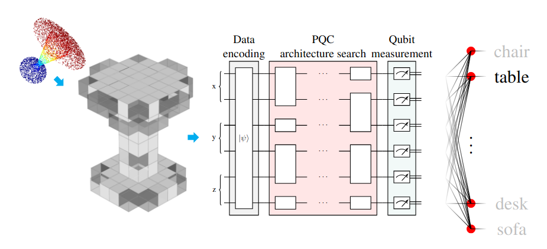
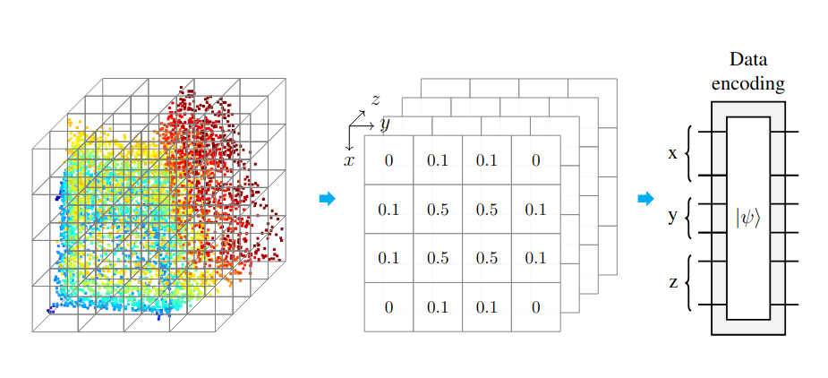
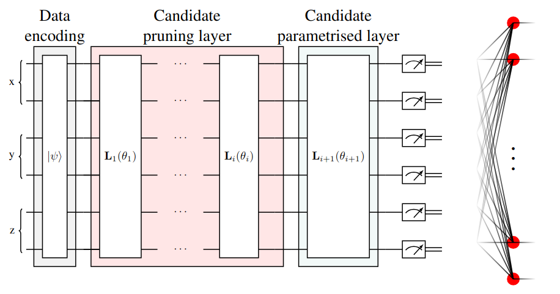

# Layered-QAS for 3D Point Cloud Classification
This code can be used to reproduce the experiments and results of our paper  
**Layered Quantum Architecture Search for 3D Point Cloud Classification**.

    @article{meli2025layered,
      title={Layered Quantum Architecture Search for 3D Point Cloud Classification},
      author={Meli, Natacha Kuete and Lukasik, Jovita and Golyanik, Vladislav and Moeller, Michael},
      journal={3DV},
      year={2026}
    }

	

Layered-QAS is a layered-Quantum Architecture Search (QAS) policy that designs Parametrised Quantum Circuit
(PQC) architectures by progressively growing and adapting them, allowing task-specific achitecture design for efficient feature extraction.

This repository demonstrates the performance of Layered-QAS on 3D Point Cloud Classification:
- The input point cloud is voxelised and used to prepare the quantum system.

	

- Then layered-QAS engineers the PQC design that will meaningfully learn features from the encoded point cloud.

	

- Learned features are extracted by measuring the qubits, and used by an optionally learnable classical linear layer for classification.

# Dataset
The paper experiments on the ModelNet dataset.
For the sake of space, only ModelNet10, with 5 samples per training and test classes has been included in the repository for the demonstration.
You can download the complete [ModelNet datasets](https://modelnet.cs.princeton.edu/) and place then under the `data` folder.

# Install
The code depends on the Python packages 
[numpy](https://numpy.org/install/), 
[torch](https://pytorch.org/),
[pennylane](https://pennylane.ai/install),
and (for plots)
[matplotlib](https://pypi.org/project/matplotlib/).

- Please download the repository and install the requirements in `requirements.txt` or refer to the product pages for reference.

- Once you satisfied the dependency, run `python -m pip install .` inside the directory.

Move to the `src` folder to run the subsequent commands.

# Example

    # Train the QML model with l-QAS
    python psr.py
    python qap.py

# Citation
If you find this work useful, please cite the article [Article URL](#).
